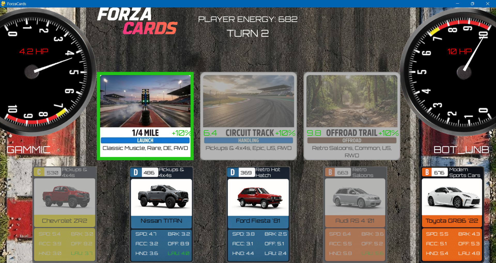

# ForzaCards - Distributed Multiplayer Card Game

**ForzaCards** è un gioco di carte strategico multiplayer basato sui dati reali delle auto di *Forza Horizon 5*.
Il progetto è un'implementazione pratica di un **Sistema Distribuito Client-Server**, sviluppato in Python utilizzando il middleware **Pyro5** per la comunicazione remota e **Pygame** per l'interfaccia grafica.



## 📋 Funzionalità Principali

* **Architettura Client-Server:** Gestione centralizzata dello stato di gioco con sincronizzazione in tempo reale tra client concorrenti.
* **Modalità PvP & PvE:** Gioca contro un altro giocatore umano in LAN o sfida l'Intelligenza Artificiale (CPU).
* **Logica di Gioco Strategica:**
    * Sistema di **Bonus Location**: Le carte ottengono potenziamenti in base a Nazione, Trazione o Classe.
    * Gestione dell'Energia (PI - Performance Index) limitata per turno.
* **Interfaccia:** Feedback visivi avanzati, ispezione carte con click destro, effetti grafici per i bonus.
* **Robustezza:** Algoritmi di fallback per la pesca delle carte e gestione thread-safe delle risorse (RLock).

## 🛠️ Tecnologie Utilizzate

* **Linguaggio:** Python 3.9+
* **Networking/RMI:** [Pyro5](https://pypi.org/project/Pyro5/) (Python Remote Objects)
* **GUI:** [Pygame](https://www.pygame.org/)
* **Data Analysis:** [Pandas](https://pandas.pydata.org/) (Gestione dataset CSV)

## ⚙️ Installazione

1.  **Clona il repository:**
    ```bash
    git clone [https://github.com/gammic/Forza_Cards.git](https://github.com/gammic/Forza_Cards.git)
    cd ForzaCards
    ```
2.  **Installa le dipendenze:**
    ```bash
    pip install -r requirements
    ```
3. **Scarica le immagini e il db:**
Le immagini possono essere scaricate da [qui](https://drive.google.com/drive/folders/1yNYbim0UUUNJyQUy9mtiA1mm8K988m9k?usp=drive_link),
mentre il db da [qui](https://drive.google.com/file/d/1GLCySHWAn7BgHaeIUSMCBbSEFD5VhF7s/view?usp=drive_link).

## 🚀 Come Avviare il Gioco

Poiché si tratta di un sistema distribuito, è necessario avviare i componenti nell'ordine corretto.

### 1. Avvia il Name Server (Pyro)
Il Name Server permette ai componenti di trovarsi sulla rete.
Per prima cosa controlla il tuo IP all'interno della LAN, e poi utilizzalo nel comando che lancia il nameserver.
Apri un terminale e lancia:
```bash
ipconfig
python -m Pyro5.nameserver --host=[tuo_IP]
```

### 2. Avvia il Game Server
In un nuovo terminale, avvia il server che gestisce la logica di gioco:
```bash
python.exe .\game_server.py
```
**Attenzione**: All'interno del game server modificare l'indirizzo IP del server (SERVER_IP) con l'IP assegnato precedentemente al name server, fare la stessa cosa con il client.

## 3. Avvia i client
In nuovi terminali (uno per ogni giocatore), avvia il client:
```bash
python.exe .\game.py
```

## 🎮 Comandi di Gioco

* **Click Sinistro (su Location)**: Seleziona la location.

* **Click Sinistro (su Carta)**: Gioca la carta sulla location selezionata.

* **Click Destro (su Carta in mano)**: Apre il popup di ispezione (Extended View) per vedere dettagli come Nazione, Trazione e Rarità.

* **ESC**: Chiude il popup o il gioco.

## 📂 Struttura del Progetto

* *game_server.py*: Logica centrale, gestione stato, thread-safety e IA.
* *game.py*: Client grafico, gestione input e polling di rete.
* *carcard.py*: Classe per la gestione e il rendering delle carte.
* *deck.py*: Logica di gestione mazzo e algoritmo di pesca.
* *AI.py*: Logica dell'agente IA.
* *location.py*: Gestione delle location e calcolo dei bonus.
* *db_cleaned.csv*: Database delle statistiche delle auto.
  
**Altri file di minore importanza**:
*  *add_drivetrain.py*: Aggiunta dell'attributo relativo alla trazione, non presente nel database originale
*  *db_cleaner.py*: Pulizia del database originale
*  *img_downloader*: Scraping del sito forzawiki per ottenere le immagini delle auto.
* *statistics_study*: EDA di alcuni dati di gioco, con risultati visibili nella cartella delle immagini (graphs).

## 🎓 Note Accademiche
Questo progetto è stato sviluppato come parte dell'esame di Algoritmi Distribuiti. Dimostra l'uso di:

* Chiamate a procedure remote (RMI).
* Gestione della concorrenza (Locks).
* Pattern architetturali distribuiti.
* Pattern Strategy (gestione Bonus) e State (fasi di gioco).

*Developed by Marco Michellini*
